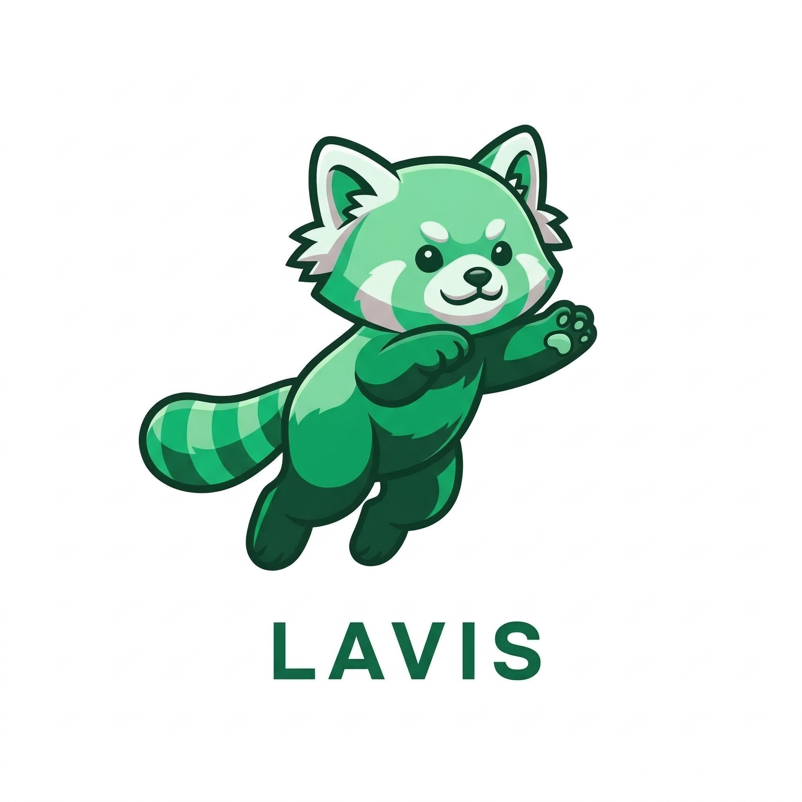

# Lavis

<p align="center">
  
</p>

Lavis is a macOS desktop AI agent that sees your screen, controls your mouse and keyboard, listens to your voice, and automates workflows -- all running locally on your machine.

## Why Lavis

Most AI assistants live inside a chat window. Lavis lives on your desktop. It can look at what is on your screen, understand it, take action, and verify the result -- the same way a human operator would, but without needing you to stay at the keyboard.

## Highlights

### Closed-Loop Autonomy

Lavis does not blindly fire actions and hope for the best. Every operation follows a **Perceive - Decide - Execute - Verify** cycle: capture a screenshot, reason about the UI state, perform an action, then take another screenshot to confirm the outcome before moving on. This self-correcting loop allows it to recover from unexpected dialogs, loading delays, or misclicks and carry multi-step tasks to completion without manual babysitting.

### Hands-Free Voice Control

You can talk to Lavis instead of typing. Say "Hi Lavis" to wake it up, speak your request, and hear the result read back to you -- all without touching the keyboard. The voice pipeline streams audio sentence by sentence for low perceived latency, and automatically summarizes long or code-heavy responses into concise spoken form rather than reading everything verbatim.

### Teach It New Tricks with Markdown

Lavis is designed to be extended without writing application code. A "skill" is just a Markdown file that describes what to do. Drop it into the skills directory and Lavis picks it up immediately -- no restart required. A skill can inject domain knowledge into the agent's reasoning context, run shell commands or AppleScript directly, or combine both: give the agent the knowledge it needs and let it figure out the execution steps on its own.

### Natural Language Scheduling

Tell Lavis "check my inbox every 30 minutes" or "remind me to stand up at 3pm" and it interprets the request into a scheduled task automatically. Tasks that fail repeatedly are auto-paused so they never spiral into infinite error loops.

### Minimal, Ambient Interface

The primary UI is a small floating capsule that stays out of your way. Its color and animation reflect what the agent is doing -- listening, thinking, executing, or idle -- so you always know the state at a glance. Click to talk, double-click to expand into a full chat panel, or ignore it entirely and let it work in the background.

### Provider-Agnostic

Lavis is not locked to a single AI vendor. Chat, speech-to-text, and text-to-speech can each be pointed at a different provider (Google Gemini, OpenAI, Alibaba DashScope/Qwen) through configuration alone. A single Gemini API key is enough to get started with all three services.

### Local-First and Private

All screen capture, reasoning, and automation happen on your machine. Screenshots are used only for real-time analysis and are cleaned up automatically. API keys never leave your local environment. Nothing is uploaded to third-party services unless you explicitly configure an external provider.

## Tech Stack

| Layer | Stack |
|---|---|
| Backend | Java 21, Spring Boot, langchain4j, SQLite, Flyway |
| Frontend | React, TypeScript, Vite, Tailwind CSS |
| Desktop | Electron |
| State | Zustand |

## Quick Start

### Prerequisites

- macOS (Intel or Apple Silicon)
- JDK 21+
- Node.js 18+

### Configure

```bash
cp .env.example .env
# Edit .env and set your API key (a Gemini API key covers chat, STT, and TTS)
```

### Run

```bash
./start.sh
```

This checks prerequisites, installs dependencies, starts the backend and frontend, and opens the Electron app. Press `Ctrl+C` to stop everything.

### Manual Start

```bash
# Terminal 1: Backend
./mvnw spring-boot:run

# Terminal 2: Frontend
cd frontend && npm install && npm run electron:dev
```

Default backend port: `18765`.

### macOS Permissions

On first launch, grant the following under System Settings > Privacy & Security:

- **Screen Recording** -- allows Lavis to capture screenshots for visual reasoning.
- **Accessibility** -- allows Lavis to control mouse and keyboard.

## Architecture

```
Frontend (Electron + React)
  -> HTTP / WebSocket
Backend (Spring Boot)
  -> LLM / STT / TTS Providers
  -> System Actions (screen capture, mouse, keyboard, AppleScript)
  -> SQLite (sessions, messages, scheduled tasks, skills)
```

## Repository Layout

```
lavis/
├── src/main/java/com/lavis/
│   ├── agent/          # Core agent logic, tools, action executors
│   ├── feature/
│   │   ├── skills/     # Skills extension system
│   │   └── scheduler/  # Task scheduler
│   ├── infra/          # LLM factories, persistence, search, TTS/STT
│   └── entry/          # Controllers, WebSocket handlers, Spring config
├── frontend/           # Electron + React desktop app
└── docs/               # User guides (English and Chinese)
```

## User Documentation

- English: [docs/User-Guide-en.md](docs/User-Guide-en.md)
- Chinese: [docs/User-Guide-zh.md](docs/User-Guide-zh.md)

## Packaging

```bash
cd frontend && npm install && npm run package
```

## Contributing

Pull requests are welcome. Recommended flow:

1. Create a feature branch
2. Keep changes scoped and documented
3. Include verification steps in PR description

## License

MIT
